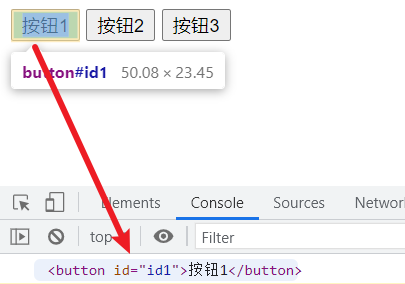

# JS—DOM-#querySelector()

> 里面传入CSS语法支持的选择器，比如标签，类，ID.如果有多个，该方法只能返回一个元素。

# 1、Input Label

```html
<!DOCTYPE html>
<html lang="en">
<head>
    <meta charset="UTF-8">
    <title>01_dom_#querySelector()</title>
</head>
<body>
<button>按钮1</button>
<button>按钮2</button>
<button>按钮3</button>
</body>
<script>
	let htmlButtonElement = document.querySelector('button')
    console.log(htmlButtonElement)
</script>
</html>
```

# 2、Input Class

```html
<!DOCTYPE html>
<html lang="en">
<head>
    <meta charset="UTF-8">
    <title>01_dom_#querySelector()</title>
</head>
<body>
<button class="class1">按钮1</button>
<button class="class1">按钮2</button>
<button class="class2">按钮3</button>
</body>
<script>
let element = document.querySelector(".class1");
console.log(element)
</script>
</html>
```

# 3、Input Id

```html
<!DOCTYPE html>
<html lang="en">
<head>
    <meta charset="UTF-8">
    <title>01_dom_#querySelector()</title>
</head>
<body>
<button id="id1">按钮1</button>
<button id="id2">按钮2</button>
<button id="id3">按钮3</button>
</body>
<script>
let element = document.querySelector("#id1");
console.log(element)
</script>
</html>
```


