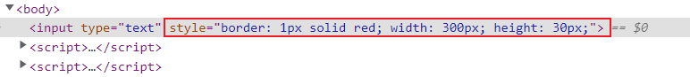

# JS-DOM-Attr-style

- DOM元素的style属性，等价于内联样式。

```html
<!DOCTYPE html>
<html lang="en">
<head>
    <meta charset="UTF-8">
    <title>JS-DOM-Attr-style</title>
</head>
<style>

</style>
<body>
<input type="text">
<script>
    let inputElement = document.querySelector('input');
    
    //1.设置输入框边框
    inputElement.style.border = '1px solid red'
    
    //2.设置输入框宽高
    inputElement.style.width = '300px'
    inputElement.style.height = '30px'

</script>
</body>
</html>
```



- 同理，如果输入框存在样式，则会修改原来的。

