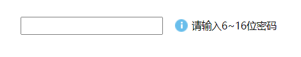
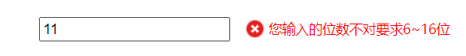
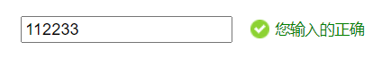

# JS-DOM-Check-Password-Give-Tip

```html
<!doctype html>
<html lang="en">
<head>
    <meta charset="UTF-8">
    <meta name="viewport"
          content="width=device-width, user-scalable=no, initial-scale=1.0, maximum-scale=1.0, minimum-scale=1.0">
    <meta http-equiv="X-UA-Compatible" content="ie=edge">
    <title></title>
</head>
<style>
    .box1{
        width: 600px;
        margin: 100px auto;
    }
    .message{
        background: url('images/mess.png') no-repeat center left;
        display: inline-block;
        padding: 20px;
        margin-left: 10px;
        font-size: 12px;
    }

</style>
<body>
<div class="box1">
    <input type="text">
    <span class="message">请输入6~16位密码</span>
</div>
<script>
    let inputElement = document.querySelector('input');
    let spanElement = document.querySelector('.message');
    inputElement.onblur = () => {
       let value = inputElement.value;

       if (value.length <6 || value.length > 16){
           spanElement.style.color ="red"
           spanElement.style.background=" url('images/wrong.png') no-repeat center left"
           spanElement.innerHTML = '您输入的位数不对要求6~16位'

       }else {
           spanElement.style.color = 'green'
           spanElement.style.background = " url('images/right.png') no-repeat center left"
           spanElement.innerHTML = '您输入的正确'
       }
    }
</script>
</body>
</html>
```

- 未操作



- 校验触发



- 成功后


