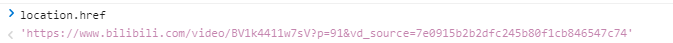

# JS-BOM-location-#href

- 利用`location`对象的`href`属性，做页面跳转。

```html
<!DOCTYPE html>
<html lang="en">

<head>
    <meta charset="UTF-8">
    <meta name="viewport" content="width=device-width, initial-scale=1.0">
    <meta http-equiv="X-UA-Compatible" content="ie=edge">
    <title>Document</title>
    <style></style>
</head>
<body>

<script>
    //获取或者设置当前浏览器的URL,可以利用他做页面跳转。
    console.log(location.href)
</script>
</body>
</html>
```


