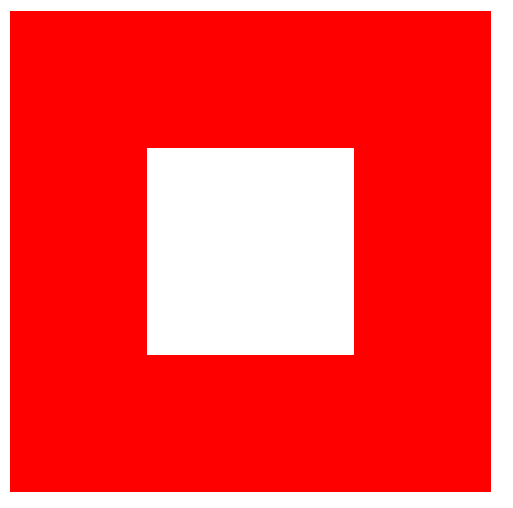

# CSS-`border: 1px solid red`

> Order 是一个显示盒子边框的属性。

# 1、border: 1px solid red

- `.box` 操作的DIV的四条变就会有1像素的红色边框。

```html
<!DOCTYPE html>
<html lang="en">
<head>
    <meta charset="UTF-8">
    <title>Title</title>
</head>
<style>
    .box{
        width: 300px;
        height: 300px;
        border: 1px solid red;
    }
</style>
<body>
<div class="box">

</div>
</body>
</html>
```


# 2、Thicker Border

```html
<!DOCTYPE html>
<html lang="en">
<head>
    <meta charset="UTF-8">
    <title>Title</title>
</head>
<style>
    .box{
        width: 150px;
        height: 150px;
        /*让边框变得更加粗*/
        border: 100px solid red;
    }
</style>
<body>
<div class="box">

</div>
</body>
</html>
```



# 3、 Change Color

- 可以设定边框为任意颜色

