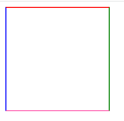

# CSS-Border-top-bottom-Left-Right

- 可以单独的控制边框的一边

```html
<!DOCTYPE html>
<html lang="en">
<head>
    <meta charset="UTF-8">
    <title>Title</title>
</head>
<style>
    .box{
        width: 150px;
        height: 150px;
        /*也可以分开控制各个边框*/
        border-top: 2px solid red;
        border-bottom: 2px solid hotpink;
        border-left: 2px solid blue;
        border-right: 2px solid green;
    }
</style>
<body>
<div class="box">

</div>
</body>
</html>
```

