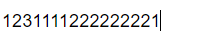

# CSS-Outline-none

-  `outline: none;` 能让input框输入没有任何边框。

```html
<!DOCTYPE html>
<html lang="en">
<head>
    <meta charset="UTF-8">
    <title>Title</title>
</head>
<style>
.inputClass{
    /*两个要结合使用*/
    border: 0;
    outline: none;
}
</style>

<body>
<input class="inputClass" type="text" value="123">
</body>
</html>
```



