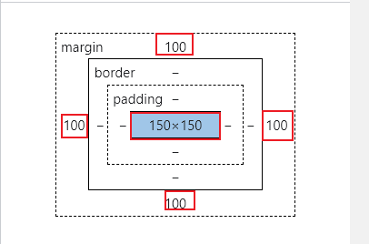

# JS-Margin

- 设定盒子的外边距

```html
<!DOCTYPE html>
<html lang="en">
<head>
    <meta charset="UTF-8">
    <title>Title</title>
</head>
<style>
.box{
    width: 150px;
    height: 150px;
     /*标识距离上下左右都是100px的外边距*/
    margin: 100px;
    background-color: red;
}
</style>
<body>
<div class="box">

</div>
</body>
</html>
```


