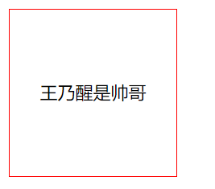

# CSS-line-height

- 在盒子中，当`line-height`属性和`width` `height` 保持一致的时候，文字就会竖直居中显示了。
- 再配合`text-align` 属性，就能让盒子文本竖直方向，水平方向都居中显示。

```html
<!doctype html>
<html lang="en">
<head>
    <meta charset="UTF-8">
    <meta name="viewport"
          content="width=device-width, user-scalable=no, initial-scale=1.0, maximum-scale=1.0, minimum-scale=1.0">
    <meta http-equiv="X-UA-Compatible" content="ie=edge">
    <title>CSS-line-height</title>
</head>
<style>
    .box1{
        width: 150px;
        height: 150px;
        border: 1px solid red;
        text-align: center;
        line-height: 150px;

    }
</style>
<body>
<div class="box1">
    王乃醒是帅哥
</div>
</body>
</html>
```


