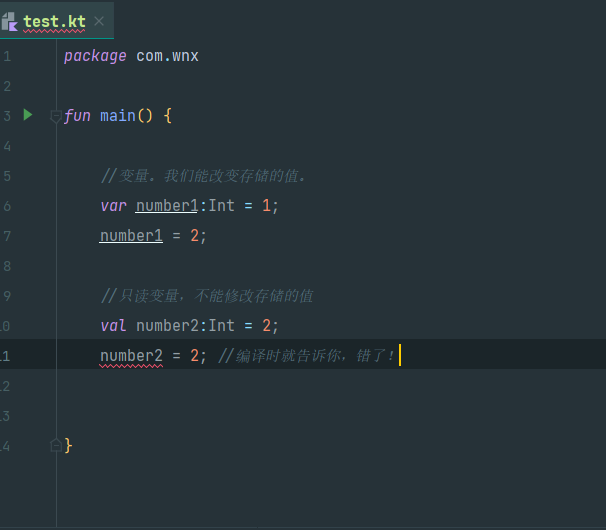

# Kotlin-Variable-Define

- Kotlin中，有`Int Double Float String Char Boolean`这些数据类型，他们以类的形式存在。

```kotlin
package com.wnx

fun main() {

    var number1:Int =  1;
    var number2:Double = 1.1;
    var number3:Float = 1.1f;

    var str1:String = "王乃醒";
    var c1:Char = 'W';

    var b1:Boolean = true;
    
}
```

- 只读变量



- 编译时常量

```kotlin
package com.wnx
//编译时常量，在程序编译期间，就为他分配内存存放初始值。
const val PI = 3.14

fun main() {
    print(PI)


}
```

