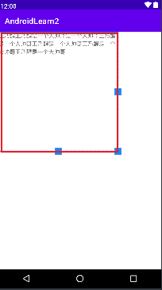

# Andorid-TextView-layout_width(height)

> 在安卓中使用`layout_width` `layout_height` 来描述一个组件的宽度和高度。

## 1、android:layout_width(height)="wrap_content"

```xml
<?xml version="1.0" encoding="utf-8"?>
<LinearLayout xmlns:android="http://schemas.android.com/apk/res/android"
    android:layout_width="match_parent"
    android:layout_height="match_parent">

    <TextView
        android:id="@+id/tv_one"   
        android:layout_width="wrap_content"
        android:layout_height="wrap_content"
        android:text="王乃醒王乃醒是一个大帅哥是一个大帅哥王乃醒是一个大帅哥王乃醒是一个大帅哥王乃醒是一个大帅哥王乃醒是一个大帅哥">
    </TextView>

</LinearLayout>
```

- `wrap_content` 则表示当前组件和组件的内容保持一致。他的宽高仅仅能容纳住组件的内容。


## 2、android:layout_width(height)="match_parent"

```xml
<?xml version="1.0" encoding="utf-8"?>
<LinearLayout xmlns:android="http://schemas.android.com/apk/res/android"
    android:layout_width="match_parent"
    android:layout_height="match_parent">

    <TextView
        android:id="@+id/tv_one"
        android:layout_width="match_parent"
        android:layout_height="match_parent"
        android:text="王乃醒王乃醒是一个大帅哥是一个大帅哥王乃醒是一个大帅哥王乃醒是一个大帅哥王乃醒是一个大帅哥王乃醒是一个大帅哥">
    </TextView>

</LinearLayout>
```

- `match_parent` 则表示当前组件和父组件保持一致。`LinearLayout` 他的宽高也是匹配父容器，所以继承下来，就是整个页面。


## 3、android:layout_width(height)="300dp"

```xml-dtd
<?xml version="1.0" encoding="utf-8"?>
<LinearLayout xmlns:android="http://schemas.android.com/apk/res/android"
    android:layout_width="match_parent"
    android:layout_height="match_parent">

    <TextView
        android:id="@+id/tv_one"
        android:layout_width="match_parent"
        android:layout_height="match_parent"
        android:text="王乃醒王乃醒是一个大帅哥是一个大帅哥王乃醒是一个大帅哥王乃醒是一个大帅哥王乃醒是一个大帅哥王乃醒是一个大帅哥">
    </TextView>

</LinearLayout>
```

- `300dp` 设定为指定的单位大小。



