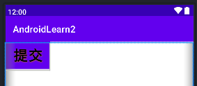
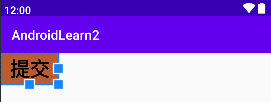

# Android-Button-HelloWorld

# 1、 Button extends TextView

```java
package android.widget;
public class Button extends TextView {}
```

# 2、Create Button 

```xml
<?xml version="1.0" encoding="utf-8"?>
<LinearLayout xmlns:android="http://schemas.android.com/apk/res/android"
    android:layout_width="match_parent"
    android:layout_height="match_parent">

    <!--拥有TextView全部的属性-->
    <Button
        android:id="@+id/bt_one"
        android:gravity="center"
        android:textSize="@dimen/wangnaixing_margin"
        android:textStyle="bold"
        android:shadowColor="@color/Red"
        android:shadowRadius="5"
        android:shadowDx="2"
        android:shadowDy="3"
        android:textColor="@color/black"
        android:background="@color/Red"
        android:text="@string/bt_submit"
        android:layout_width="wrap_content"
        android:layout_height="wrap_content">

    </Button>

</LinearLayout>
```



# 3、Find Bug

- 发现在`Android SDK 32` 按钮的颜色不能变化，始终为蓝色。而本配置中已经设定为红色了。

## 1、Need Update Config

- 修正为` parent="Theme.MaterialComponents.DayNight.DarkActionBar.Bridge"`

```xml
<resources xmlns:tools="http://schemas.android.com/tools">
    <style name="Theme.AndroidLearn2" parent="Theme.MaterialComponents.DayNight.DarkActionBar.Bridge">
       
        <item name="colorPrimary">@color/purple_500</item>
        <item name="colorPrimaryVariant">@color/purple_700</item>
        <item name="colorOnPrimary">@color/white</item>
       
        <item name="colorSecondary">@color/teal_200</item>
        <item name="colorSecondaryVariant">@color/teal_700</item>
        <item name="colorOnSecondary">@color/black</item>
        <item name="android:statusBarColor" tools:targetApi="l">?attr/colorPrimaryVariant</item>
  
    </style>

    <style name="Theme.AndroidLearn2.NoActionBar">
        <item name="windowActionBar">false</item>
        <item name="windowNoTitle">true</item>
    </style>

    <style name="Theme.AndroidLearn2.AppBarOverlay" parent="ThemeOverlay.AppCompat.Dark.ActionBar" />
    <style name="Theme.AndroidLearn2.PopupOverlay" parent="ThemeOverlay.AppCompat.Light" />
</resources>
```

## 2、Validation Success

