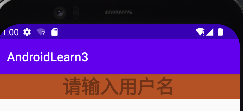

# Android-EditText-hint

-  `android:hint="请输入用户名"` 等价于input框的placeholder,输入一些辅助提示。

```xml
<?xml version="1.0" encoding="utf-8"?>
<LinearLayout
    xmlns:android="http://schemas.android.com/apk/res/android"
    android:layout_height="match_parent"
    android:layout_width="match_parent">

    <!--输入框提示-->
    <EditText
        android:id="@+id/et_one"
        android:gravity="center"
        android:textSize="@dimen/wangnaixing_margin"
        android:textStyle="bold"
        android:shadowColor="@color/red"
        android:shadowRadius="5"
        android:shadowDx="2"
        android:shadowDy="3"
        android:textColor="@color/black"
        android:background="@color/red"
        android:hint="请输入用户名"
        android:layout_width="match_parent"
        android:layout_height="wrap_content">
    </EditText>

</LinearLayout>
```

