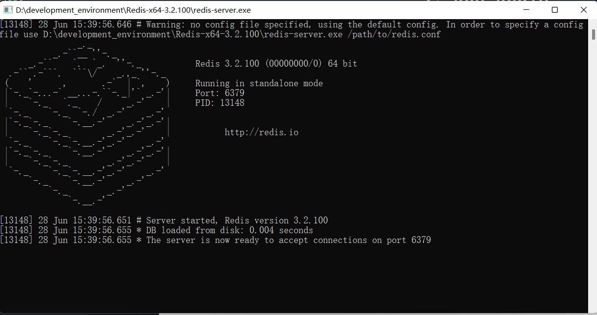
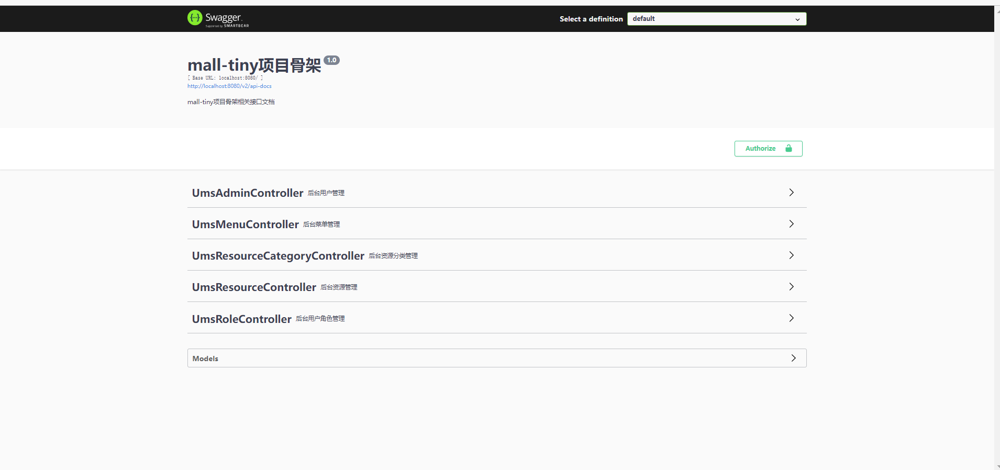

# Mall-Tiny-Start-Project

# 1、Clone Back Project

进入`GitHub`,克隆作者项目。

```shell
git clone https://api.mtr.pub/macrozheng/mall-tiny.git
```

# 2、Run Redis

启动Redis.




# 3、Swagger UI 

运行SpringBoot程序进程，通过Swagger-UI访问接口文档。

```shell
http://localhost:8080/swagger-ui/
```

